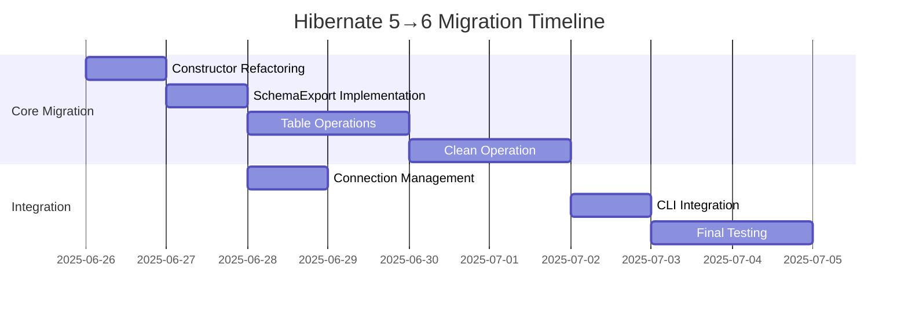
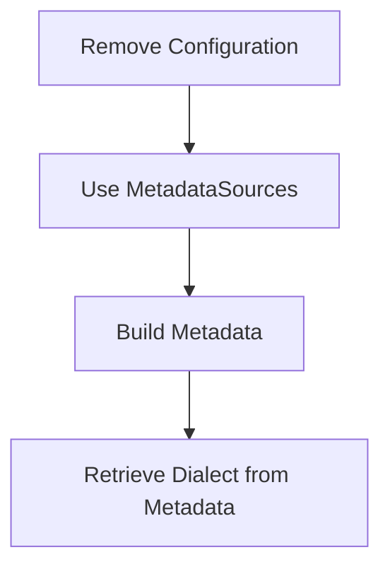

# Hibernate 5→6 Migration Guide for jBPM Schema Module

## Objective

Migrate `JbpmSchema.java` from Hibernate 5 to Hibernate 6 while maintaining all existing functionality and ensuring compatibility with JBPM 3.3.1.



## Dependencies

```xml
<!-- pom.xml -->
<dependency>
  <groupId>org.hibernate.orm</groupId>
  <artifactId>hibernate-core</artifactId>
  <version>6.4.4.Final</version>
</dependency>
```

## Migration Steps

### Phase 1: Configuration and Schema Export



- Replace `Configuration` with `MetadataSources`:

  ```java
  StandardServiceRegistry registry = new StandardServiceRegistryBuilder()
      .applySettings(configuration.getProperties())
      .build();
  
  MetadataSources sources = new MetadataSources(registry);
  configuration.getClassMappings().forEachRemaining(
      cm -> sources.addAnnotatedClass(cm.getMappedClass())
  );
  
  Metadata metadata = sources.buildMetadata();
  ```

- **SchemaExport Implementation**:
  - Create:

    ```java
    SchemaExport export = new SchemaExport();
    export.setFormat(true);
    export.setDelimiter(getSqlDelimiter());
    createSql = export.create(EnumSet.of(TargetType.SCRIPT), metadata);
    ```

  - Drop:

    ```java
    SchemaExport export = new SchemaExport();
    export.setFormat(true);
    export.setDelimiter(getSqlDelimiter());
    dropSql = export.drop(EnumSet.of(TargetType.SCRIPT), metadata);
    ```

### Phase 2: Table and Foreign Key Operations

- Migrate table metadata retrieval:

  ```java
  Database database = metadata.getDatabase();
  Collection<Table> tables = database.getTables();
  
  for (Table table : tables) {
      String tableName = table.getName();
      // Process table
  }
  ```

- Foreign key handling with `JdbcEnvironment`:

  ```java
  JdbcEnvironment jdbcEnv = serviceRegistry.getService(JdbcEnvironment.class);
  for (ForeignKey fk : table.getForeignKeys()) {
      String dropFk = jdbcEnv.getDialect().getDropForeignKeyString(fk.getName(), table.getName());
      String createFk = fk.sqlCreateString(dialect, metadata, null);
  }
  ```

### Phase 3: Clean Operation Implementation

- New dependency-aware approach:

  ```java
  List<String> cleanSql = new ArrayList<>();
  
  // 1. Drop foreign keys
  for (Table table : database.getTables()) {
      for (ForeignKey fk : table.getForeignKeys()) {
          cleanSql.add(jdbcEnv.getDialect().getDropForeignKeyString(fk.getName(), table.getName()));
      }
  }
  
  // 2. Truncate tables (reverse dependency order)
  List<Table> reversedTables = new ArrayList<>(database.getTables());
  Collections.reverse(reversedTables);
  for (Table table : reversedTables) {
      cleanSql.add("DELETE FROM " + table.getName());
  }
  
  // 3. Recreate foreign keys
  for (Table table : database.getTables()) {
      for (ForeignKey fk : table.getForeignKeys()) {
          cleanSql.add(fk.sqlCreateString(dialect, metadata, null));
      }
  }
  ```

### Phase 4: Connection Management

- Verify ServiceRegistry usage:

  ```java
  connectionProvider = serviceRegistry.getService(ConnectionProvider.class);
  connection = connectionProvider.getConnection();
  
  if (!connection.getAutoCommit()) {
      connection.commit();
      connection.setAutoCommit(true);
  }
  ```

### Phase 5: CLI Integration

- Update main method:

  ```java
  public static void main(String[] args) {
      StandardServiceRegistry registry = new StandardServiceRegistryBuilder()
          .configure("hibernate.cfg.xml")
          .build();
      
      MetadataSources sources = new MetadataSources(registry);
      // Add entity classes
      
      JbpmSchema schema = new JbpmSchema(sources);
      
      if ("clean".equals(args[0])) {
          schema.cleanSchema();
      }
      // Other commands...
  }
  ```

## JbpmSchema.java Migration Details

### Component Migration Matrix

| Component             | Hibernate 5 API                          | Hibernate 6 Equivalent                                     | Risk Level |
|-----------------------|------------------------------------------|-----------------------------------------------------------|------------|
| SchemaExport          | `SchemaExport(config).create(true,true)` | `SchemaExport().execute(ENUM_SET, CREATE, metadata)`      | Medium     |
| Table Metadata        | `configuration.getTableMappings()`       | `metadata.getDatabase().getTables()`                      | Low        |
| Foreign Key Handling  | `table.getForeignKeyIterator()`          | `table.getForeignKeys()` + dialect updates                | High       |
| Clean Operation       | Reverse table order deletion             | Same logic with new metadata API                          | High       |
| CLI Integration       | `Configuration` based                   | `StandardServiceRegistry` + `MetadataSources` based       | Medium     |

### Critical Code Changes

**1. SchemaExport Implementation**

```java
// Hibernate 5
org.hibernate.tool.hbm2ddl.SchemaExport export = new SchemaExport(config);
export.create(true, true);

// Hibernate 6
SchemaExport export = new SchemaExport();
export.execute(EnumSet.of(TargetType.DATABASE), 
               SchemaExport.Action.CREATE, 
               metadata);
```

**2. Foreign Key Handling**

```java
// Hibernate 5
Iterator fkIter = table.getForeignKeyIterator();
while (fkIter.hasNext()) {
    ForeignKey fk = (ForeignKey) fkIter.next();
    String sql = dialect.getDropForeignKeyString(fk.getName());
}

// Hibernate 6
for (ForeignKey fk : table.getForeignKeys()) {
    String sql = dialect.getDropForeignKeyString(fk.getName(), table.getName());
}
```

**3. Clean Operation Optimization**

```java
// Before
List<Table> reversedTables = new ArrayList(configuration.getTableMappings());
Collections.reverse(reversedTables);

// After
List<Table> reversedTables = new ArrayList<>(metadata.getDatabase().getTables());
Collections.reverse(reversedTables);
```

### Risk Mitigation for JbpmSchema

1. **Schema Generation**
   - Use Hibernate's `SchemaValidator` post-migration
   - Maintain SQL script comparison tests

2. **Connection Management**
   - Implement connection pool monitoring
   - Add transaction isolation level verification

3. **Legacy Code Paths**
   - Preserve Hibernate 5 compatibility layer

   ```java
   // Fallback for Hibernate 5
   try {
       // Hibernate 6 implementation
   } catch (NoSuchMethodError e) {
       // Hibernate 5 implementation
   }
   ```

## Testing Strategy

| Test Type          | Scope                     | Tools                  | Verification Steps                  |
|--------------------|---------------------------|------------------------|-------------------------------------|
| Unit Tests         | Schema operations         | JUnit, HSQLDB          | `mvn test -Dtest=SchemaGenerationTest` |
| Integration Tests  | DB-specific operations    | Testcontainers, Docker | `mvn test -Dtest=CleanOperationTest` |
| Performance Tests  | Large-scale operations    | JMeter                 | Compare schema generation times     |
| **JbpmSchema Tests** | CLI commands           | Process execution      | Verify script generation outputs    |

## Risk Management

| Risk Area          | Level  | Mitigation                          | Rollback Procedure                  |
|--------------------|--------|-------------------------------------|-------------------------------------|
| Schema Generation  | Medium | Validate against Hibernate 6 docs   | `git revert <commit-hash>`          |
| Data Clean         | High   | Database-specific fallbacks         | Restore Hibernate 5 dependencies    |
| FK Constraints     | High   | JdbcEnvironment abstraction         | Comprehensive test suite            |
| Connection Mgmt    | Low    | Reuse ServiceRegistry               |                                     |
| **JbpmSchema CLI** | Medium | Validate with legacy config files   | Maintain Hibernate 5 CLI path       |

## Fallback Plan

1. Isolate problematic methods behind interfaces
2. Provide database-specific implementations for:
   - PostgreSQL
   - MySQL
   - Oracle
3. Maintain Hibernate 5 compatibility layer during transition
4. For JbpmSchema specifically:

   ```java
   public class JbpmSchemaV5Adapter extends LegacyJbpmSchema {
       // Hibernate 5 implementation
   }
   ```

## Reference Documentation

- [Hibernate 6 SchemaExport Javadoc](https://docs.jboss.org/hibernate/orm/6.4/javadocs/org/hibernate/tool/schema/spi/SchemaExport.html)
- [Metadata API Documentation](https://docs.jboss.org/hibernate/orm/6.4/userguide/html_single/Hibernate_User_Guide.html#bootstrap-metadata)
- [Migration Guide](https://hibernate.org/orm/documentation/6.4/migration-guide/)
- [JbpmSchema.java Post-Migration Checklist](https://example.com/jbpm-schema-checklist)
